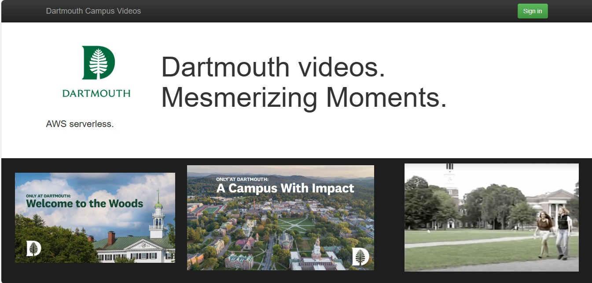
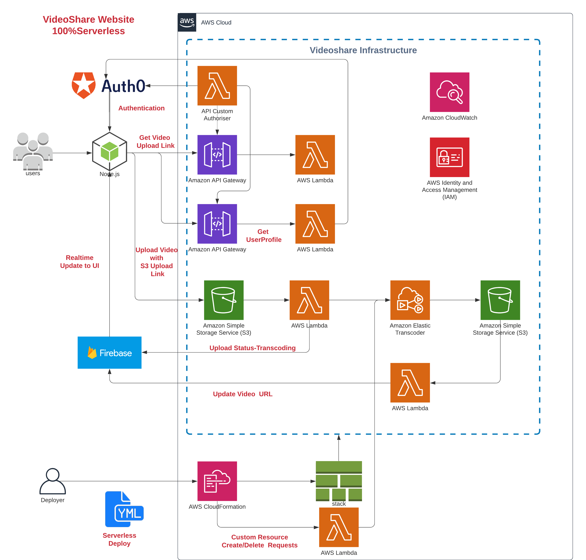

# AWS Video Share Website Serverless: Scalable Video Sharing Platform

## Architecture

For a visual representation of our project's architecture, refer to the following diagram:

We look forward to sharing the journey of creating this serverless video sharing website on the AWS platform. Through the integration of cutting-edge technologies and innovative solutions, we aim to provide a seamless video sharing experience for dartmouth students

## Features

Our project encompasses a range of features aimed at providing a comprehensive video sharing solution:

1.  **Elastic Transcoder Pipeline Creation**: Through the utilization of a custom resource template and Lambda function orchestration, we establish an Elastic Transcoder pipeline. This facilitates the efficient transcoding of videos into various formats.
    
2.  **Transcoder Job Management**: We implement a Lambda function dedicated to managing transcoding jobs. This function handles the execution and tracking of transcoding processes.
    
3.  **Integrated Website with Auth0**: Our video hosting platform comes complete with a user-friendly website. We seamlessly integrate this website with Auth0, a robust authentication and authorization service.
    
4.  **User Profile Management**: A dedicated Lambda function communicates with Auth0, retrieving crucial user information for streamlined profile management.
    
5.  **API Gateway with Custom Authorizer**: We employ AWS API Gateway along with a custom authorizer implemented as a Lambda function. This ensures that only authenticated users gain access to the User Profile Lambda function.
    
6.  **File Upload Authorization**: Leveraging AWS Lambda and API Gateway, we grant credentials and policies to users, enabling secure file uploads to an S3 bucket.
    
7.  **Firebase Realtime Database**: To manage video information and facilitate real-time content delivery to browsers, we incorporate Google Firebase Realtime Database.
    

## Challenges and Solutions

Throughout the development of this project, we encountered and successfully addressed several challenges:

1.  **Custom Resource Creation**: We tackled the challenge of creating custom resources within a serverless context where a CloudFormation template was unavailable. Our solution involved invoking a custom Lambda function during the CloudFormation deployment process.
    
2.  **Lambda Authorizer for API Gateway**: Implementing a Lambda authorizer for the AWS API Gateway was a noteworthy challenge. Through careful design and configuration, we established a robust and effective authorization mechanism.
    
3.  **User Management and Key Passing**: Creating users and securely passing keys to Lambda functions posed another hurdle. By implementing established security practices and AWS features, we ensured the safe management of user data and authentication credentials.
    

